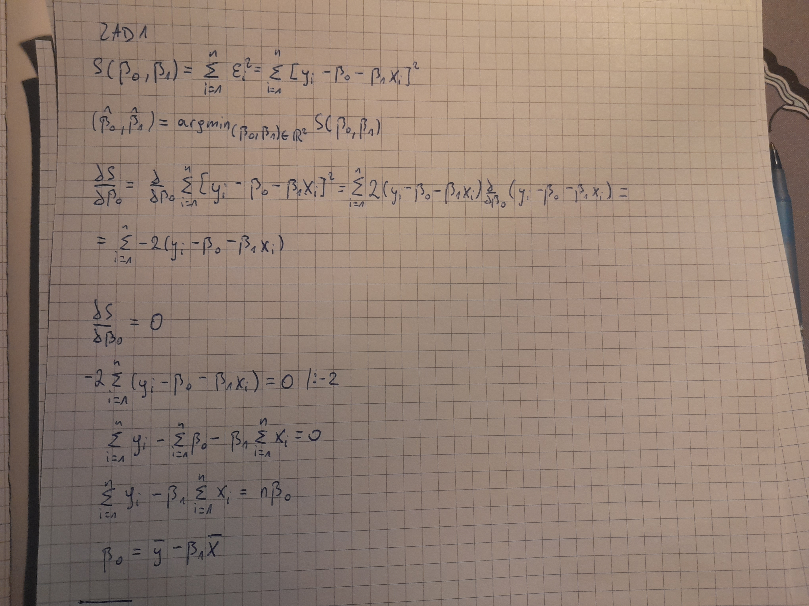
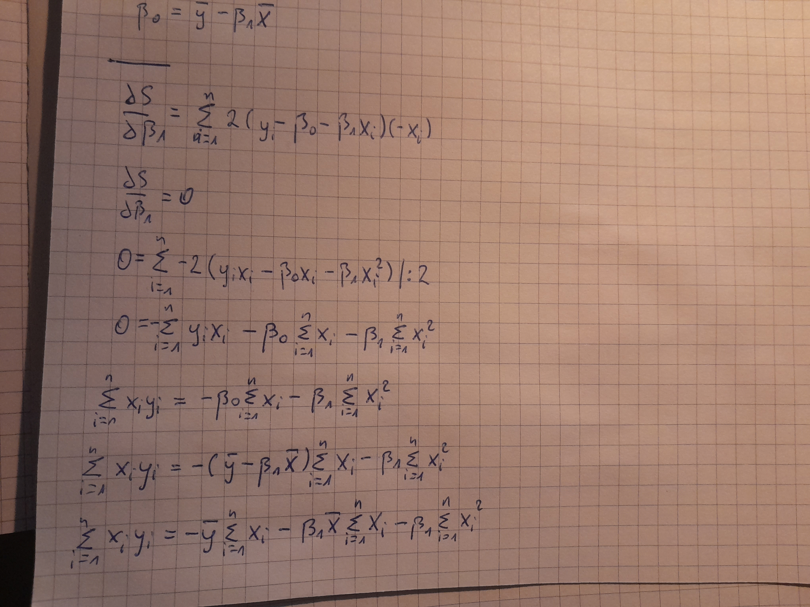
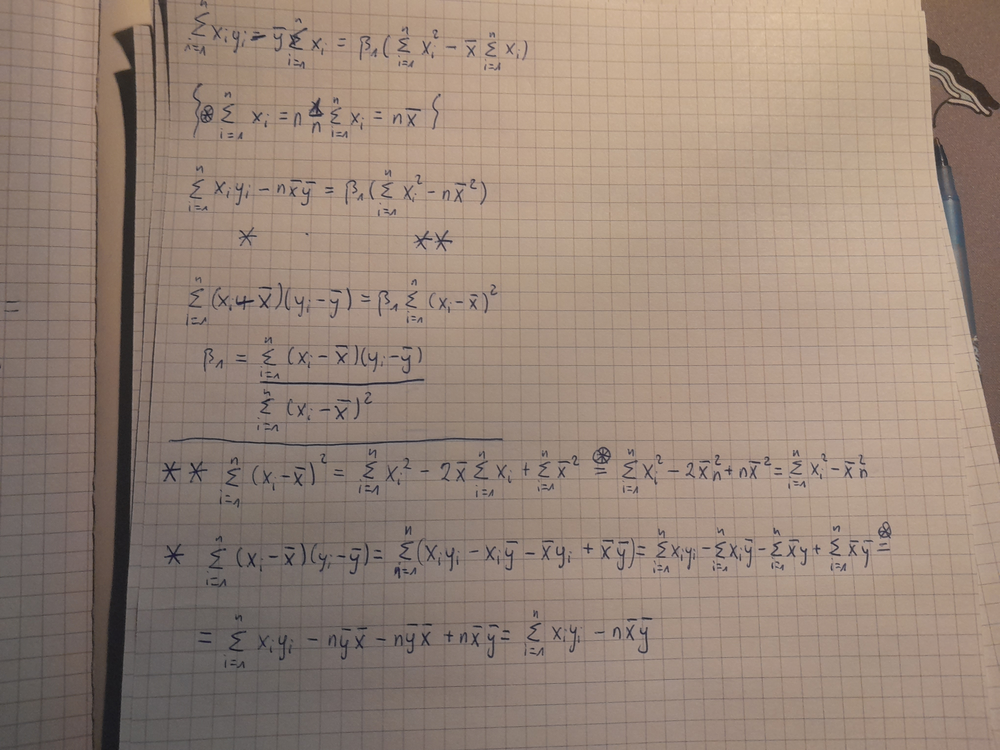
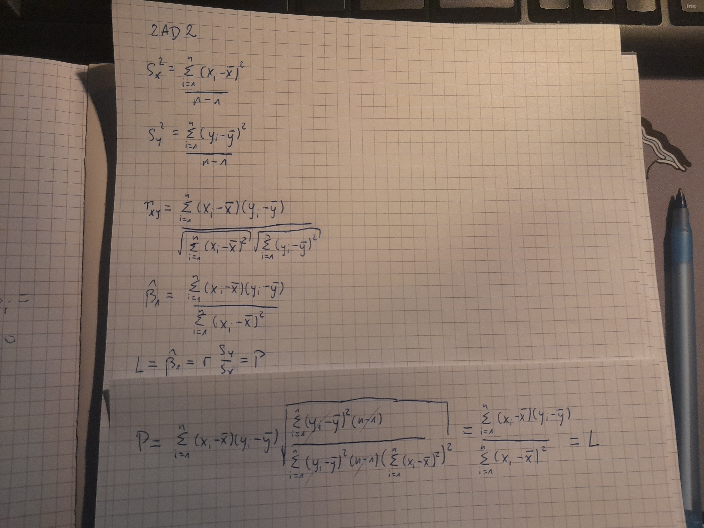
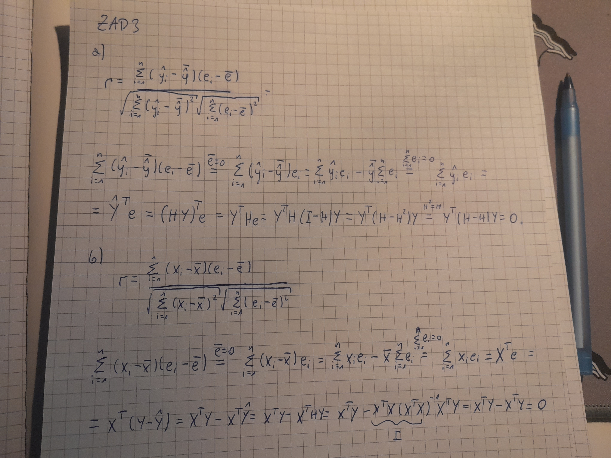

```{r setup, include=FALSE}
knitr::opts_chunk$set(echo = TRUE)
knitr::opts_chunk$set(warning = FALSE, message = FALSE) 
knitr::opts_chunk$set(fig.pos = "H", out.extra = "", fig.align = "center")
```

# 1

Dla każdej ze zmiennych y i x pojawiających się w pliku wyznacz podstawowe wskaźniki numeryczne charakteryzujące próbę: średnią, wariancję, odchylenie standardowe, medianę, pierwszy i trzeci kwartyl, minimum i maksimum. Skonstruuj też histogramy i box-ploty.

```{r średnia, echo=TRUE, eval=TRUE}
dane<-read.table("lab1.txt",sep="",header=TRUE)

x_mean = mean(dane$x)
y_mean = mean(dane$y)
```

wartość średniej kolumny x to :

`r toString(x_mean)`,

natomiast dla kolumny y:

`r toString(y_mean)`.

```{r wariancja, echo=TRUE, eval=TRUE}

x_var = var(dane$x)
y_var = var(dane$y)

```

wartość wariancji kolumny x:

`r toString(x_var)`,

natomiast dla kolumny y:

`r toString(y_var)`.

```{r odchylenie_standardowe, echo=TRUE, eval=TRUE}

x_sd = sd(dane$x)
y_sd = sd(dane$y)

```

wartość odchylenia standardowego dla kolumny x:

`r toString(x_sd)`,

natomiast dla kolumny y:

`r toString(x_sd)`.

```{r mediana, echo=TRUE, eval=TRUE}

x_median = median(dane$x)
y_median = median(dane$y)

```

Wartość mediany dla kolumny x:

`r toString(x_median)`,

natomiast dla kolumny y:

`r toString(y_median)`.

```{r kwantyle, echo=TRUE, eval=TRUE}

x_quanrtiles = quantile(dane[,1],c(0.25,.75))
y_quanrtiles = quantile(dane[,2],c(0.25,.75))

```

Wartość pierwszego kwantylu dla kolumny x:

`r toString(x_quanrtiles[1])`.

Wartość trzeciego kwantylu to:

`r toString(x_quanrtiles[2])`.

Dla kolumny y - pierwszy kwantyl:

`r toString(y_quanrtiles[1])`,

a trzeci kwantyl wynosi: `r toString(y_quanrtiles[2])`.

```{r minimum, echo=TRUE, eval=TRUE}
x_min = min(dane[,1])
y_min = min(dane[,2])
```

Wartość minimalna kolumny x:

`r toString(x_min)`,

natomiast kolumny y to:

`r toString(y_min)`.

```{r maksimum, echo=TRUE, eval=TRUE}
x_max = max(dane[,1])
y_max = max(dane[,2])
```

Wartość maksymalna kolumny x:

`r toString(x_max)`,

natomiast kolumny y to:

`r toString(y_max)`.

```{r histogram_zad1_x, echo=TRUE, eval=TRUE, fig.cap="\\label{fig:histogram_zad1_x}histogram x ZADANIE 1"}
hist(dane$x,main="histogram zmiennej objaśniającej x",col = "green",xlab='x')
```

```{r histogram_zad1_y, echo=TRUE, eval=TRUE, fig.cap="\\label{fig:histogram_zad1_y}histogram y ZADANIE 1"}
hist(dane$y,main="histogram zmiennej objaśnianej y",col = "red",xlab = 'y')
```

```{r boxplot_zad1_x, echo=TRUE, eval=TRUE, fig.cap="\\label{fig:boxplot_zad1_x}boxplot x ZADANIE 1"}
boxplot(dane$x,main="box-plot zmiennej objaśniającej x",col = "green")
```

```{r boxplot_zad1_y, echo=TRUE, eval=TRUE, fig.cap="\\label{fig:boxplot_zad1_y}boxplot y ZADANIE 1"}
boxplot(dane$y,main="box-plot zmiennej objaśnianej y",col = "red")
```

# 2

Wykonaj wykres rozproszenia zmiennych $y$ i $x$ i oblicz współczynnik korelacji próbkowej tych zmiennych. Czy chmura punktów na tym wykresie ma (w przybliżeniu) charakter liniowy? Uzasadnij dlaczego można wykorzystać model regresji liniowej $y = \beta_{0} + \beta_{1} \cdot x + \mathcal{E}$

do opisu zależności między zmiennymi $y$ i $x$?

```{r zad2, echo=TRUE, eval=TRUE, fig.cap="\\label{fig:zad2}wykres rozproszenia ZADANIE 2"}
plot(dane$x,dane$y,xlab="zmienna objaśniająca x", ylab="zmienna objaśniana y", pch=19)
```

```{r korelacja, echo=TRUE, eval=TRUE}
corr=cor(dane$x,dane$y)
```

Jak wizadć z wykresu \ref{fig:zad2} chmura punktów ma charakter liniowy, natomiast współczynnik korelacji próbkowej między $x$ a $y$ wynosi `r toString(corr)` więc możemy wnioskować o silnej liniowej korelacji pomiędzy tymi zmiennymi. Uzasadnione jest więc użycie modelu regresji liniowej.

# 3

Wyznacz wartości estymatorów najmniejszych kwadratów $\hat{\beta_{0}}$ i $\hat{\beta_{1}}$ parametrów $\beta_{0}$ i $\beta_{1}$.

```{r zadanie_3, echo=TRUE, eval=TRUE}
x<-dane$x
y<-dane$y
model<-lm(y~x)
b_0=model$coefficients[1]
b_1=model$coefficients[2]
```

Wartości estymatorów to:

$\hat{\beta_{0}}$ = `r toString(b_0)`,

$\hat{\beta_{0}}$ = `r toString(b_1)`.

# 4

Znajdź wartość estymatora $\hat{\sigma^{2}} := \frac{\sum_{i=1}^{n}(y_{i}-\hat{y_{i}})^2}{n-2}$ parametru $\sigma^{2}$.

```{r zadanie_4, echo=TRUE, eval=TRUE}
sigma_squared_hat=(summary(model)$sigma)**2
```

Wartość estymatora $\hat{\sigma^{2}}$ wynosi `r toString(sigma_squared_hat)`.

# 5

Na poziomie istotności $\alpha = 0,05$ zweryfikuj hipotezę $H_{0} : \beta_{1} = 0$ przy hipotezie alternatywnej $H_{1} : \beta_{1} \neq 0$. Jaka jest p-wartość dla tego testu? Czy na podstawie tych wyników można stwierdzić, że rozpatrywany w tym przykładzie model regresji liniowej ma sens?

```{r zadanie_5, echo=TRUE, eval=TRUE}
T_stat=summary(model)$coefficients[2,3]
t=qt(0.975,98)
p_value=summary(model)$coefficients[2,4]
```

Wartość statystyki $T$ wynosi `r toString(T_stat)`. Hipoteza zerowa może być odrzucona na poziomie istotności $\alpha = 0,05$ gdy wartość bezwzględna statystyki T jest większa niż $t_{\alpha/2,n-2}$ - kwantyl rzędu $1-\alpha/2$ rozkładu t-Studenta z n-2 stopniami swobody. W tym przypadku: $n=100$, $n-2=98$, $1-\alpha/2 = 0,975$, $t_{\alpha/2,n-2}$ = `r toString(t)`. `r toString(T_stat)` \> `r toString(t)` więc hipotezę zerową możemy odrzucić na poziomie istotności $\alpha = 0,05$. Ten test ma p-wartość równą `r toString(p_value)`.

# 6

Skonstruuj przedział ufności dla $\beta_{1}$ na poziomie ufności $0.99$.

```{r zadanie_6, echo=TRUE, eval=TRUE}
c=confint(model,level=0.99)
```

Przedział ufności na poziomie ufności $0.99$ wynosi [`r toString(c[2,1])`, `r toString(c[2,2])`]

# 7

Dla $x_{0} = 1$ oblicz prognozowaną przez model wartość $\hat{Y}(x_{0})$. Następnie wyznacz przedziały ufności na poziomie ufności $0.99$ dla $Y(x_{0})$.

```{r zadanie_7, echo=TRUE, eval=TRUE}
x_0<-data.frame(x=1)
pred=predict(model,newdata=x_0,interval=c("confidence"),level=0.99)
```

Wartość $\hat{Y}(x_{0})$ jest równa `r toString(pred[1])`. Przedział ufności na poziomie ufności $0.99$ dla $Y(x_{0})$ wynosi [`r toString(pred[2])`, `r toString(pred[3])`].

# 8

Narysuj histogram i wykres kwantylowy dla rezyduów. Narysuj też wykresy rozproszenia dla prób $(\hat{y_{1}},e_{1}),\ldots,(\hat{y_{n}},e_{n}$ i $(x_{1},e_{1}),\ldots,(x_{n},e_{n})$. Czy na podstawie tych rysunków można stwierdzić, że któreś założeń modelu regresji nie jest spełnione (patrz zadanie teoretyczne 3.)?

```{r zad8_histogram, echo=TRUE, eval=TRUE, fig.cap="\\label{fig:zad8_histogram}histogram rezyduów ZADANIE 8"}
hist(model$residuals,main="Histogram rezyduów",xlab="rezydua",col = 'orange')
```

```{r zad8_qqplot, echo=TRUE, eval=TRUE, fig.cap="\\label{fig:zad8_qqplot}Wykres kwantylowy rezyduów ZADANIE 8"}
qqnorm(model$residuals,main="Wykres kwantylowy rezyduów",col = 'blue')
```

```{r zad8_w1, echo=TRUE, eval=TRUE, fig.cap="\\label{fig:zad8_w1}Wykres rozproszenia próba 1 ZADANIE 8"}
y_hat=predict(model,newdata=list(dane$x))
plot(y_hat,model$residuals,xlab="przewidywane wartości",ylab = "rezydua",main="Wykres rozproszenia 1")
```

```{r zad8_w2, echo=TRUE, eval=TRUE, fig.cap="\\label{fig:zad8_w2}Wykres rozproszenia próba 2 ZADANIE 8"}
plot(y,model$residuals,xlab="prawdziwe wartości",ylab = "rezydua",main="Wykres rozproszenia 2")
```

Na podstawie wykresów można stwierdzić że założenia modelu są spełnione.

# 9

Zmodyfikuj dane z pliku lab1.txt, przyjmując, że ostatnią obserwacją jest $6,9347$ i $148,6400$, a nie $6,9347$ i $14, 8640$. Wyznacz estymatory najmniejszych kwadratów parametrów $\beta_{0}$ i $\beta_{1}$ i porównaj je z estymatorami otrzymanymi poprzednio. Co zauważasz? Czy obserwacja $(6,9347; 148,640)$ jest a) odstająca, b) wpływowa?

```{r zadanie_9, echo=TRUE, eval=TRUE}
dane2=dane
dane2[100,1]=6.9347
dane2[100,2]=148.6400

x2<-dane2$x
y2<-dane2$y
model<-lm(y2~x2)
b_0_2=model$coefficients[1]
b_1_2=model$coefficients[2]
```

Poprzednio otrzymane estymatory miały wartości:

$\hat{\beta_{0}}$ = `r toString(b_0)`,

$\hat{\beta_{0}}$ = `r toString(b_1)`.

Po zmianie ostatniej obserwacji na $(6,9347; 148,640)$:

$\hat{\beta_{0}}^{nowe}$ = `r toString(b_0_2)`,

$\hat{\beta_{0}}^{nowe}$ = `r toString(b_1_2)`.

Więc obserwacja $(6,9347; 148,640)$ jest odstająca i wpływowa.

# 10

Niech $n=100$, $x_{1},x_{2},\ldots,x_{n}$ iid $U(0,1)$, $\mathcal{E}_{1},\mathcal{E}_{2},\ldots,\mathcal{E}_{n}$ iid $N(0,\sigma^{2})$, $\sigma=0.1$, $\beta_{0}=1$, $\beta_{1}=2$.

## a

Wygeneruj obserwacje $y_{1},y_{2},\ldots,y_{n}$, takie że $y_{i} = \beta_{0} + \beta_{1}\cdot x_{i}+\mathcal{E}_{i}$, $i=1,\ldots,n$.

```{r zadanie_10_a, echo=TRUE, eval=TRUE}
set.seed(1) #w celu reprodukowalności wyników ustawiam ziarno generatora
b0=rep(1,100)
set.seed(1)
x_new<-runif(100)
set.seed(1)
errors<-rnorm(100,0,0.1)

y_new<-b0+2*x_new+errors
```

## b

Wykonaj wykres rozproszenia dla próby $(x_{1},y_{1}),\ldots,(x_{n},y_{n})$. Czy chmura punktów ma (w przybliżeniu) charakter liniowy?

```{r zadanie_10_b, echo=TRUE, eval=TRUE, fig.cap="\\label{fig:zadanie_10_b}Wykres rozproszenia ZADANIE 10b"}
plot(x_new,y_new,main="wykres rozproszenia wygenerowanej próby",xlab="x",ylab="y")
```

Chmura punktów na wykresie \ref{fig:zadanie_10_b} ma w przybliżeniu charakter liniowy.

## c

W oparciu o próbę $(x_{1},y_{1}),\ldots,(x_{n},y_{n})$ wyznacz estymatory najmniejszych kwadratów $(\hat{\beta_{0}},\hat{\beta_{1}})$ parametrów $(\beta_{0},\beta_{1})$. Porównaj wartości tych estymatorów z wartościami $(\beta_{0},\beta_{1})$.

```{r zadanie_10_c, echo=TRUE, eval=TRUE}
model_new<-lm(y_new~x_new)
b_0_new=model_new$coefficients[1]
b_1_new=model_new$coefficients[2]
```

Otrzymane estymatory mają wartości:

$\hat{\beta_{0}}$ = `r toString(b_0_new)`,

$\hat{\beta_{0}}$ = `r toString(b_1_new)`.

Są one bardzo zbliżone do wartości parametrów $(\beta_{0},\beta_{1})=(1,2)$

## d

Powtórz obliczenia dla $\sigma = 0.5$ i $\sigma=1$. Jak zmieniają się precyzja estymatorów i współczynnik $R^{2}$, gdy rośnie $\sigma^{2}$

```{r zadanie_10_d, echo=TRUE, eval=TRUE}

set.seed(1)
errors1<-rnorm(100,0,0.5)
set.seed(1)
errors2<-rnorm(100,0,1)

y_new1<-b0+2*x_new+errors1
y_new2<-b0+2*x_new+errors2

model_new1<-lm(y_new1~x_new)
b_0_new1=model_new1$coefficients[1]
b_1_new1=model_new1$coefficients[2]

model_new2<-lm(y_new2~x_new)
b_0_new2=model_new2$coefficients[1]
b_1_new2=model_new2$coefficients[2]

summary1=summary(model_new1)
summary2=summary(model_new2)

R_2_1=summary1$r.squared
R_2_2=summary2$r.squared
```

Dla $\sigma = 0.5$:

Otrzymane estymatory mają wartości:

$\hat{\beta_{0}}$ = `r toString(b_0_new1)`,

$\hat{\beta_{0}}$ = `r toString(b_1_new1)`.

Współczynnik $R^{2}$ ma wartość:

$R^{2}$ = `r toString(R_2_1)`.

Dla $\sigma = 1$:

Otrzymane estymatory mają wartości:

$\hat{\beta_{0}}$ = `r toString(b_0_new2)`,

$\hat{\beta_{0}}$ = `r toString(b_1_new2)`.

Współczynnik $R^{2}$ ma wartość:

$R^{2}$ = `r toString(R_2_2)`.

Precyzja estymatorów spada wraz ze wzrostem wartości $\sigma^{2}$, a wartość współczynnika $R^{2}$ maleje.

# Zadania teoretyczne

# 1

Rozważmy model regresji liniowej z jedną zmienną objaśniającą $y = \beta_{0} + \beta_{1} \cdot x + \mathcal{E}$, tworzony na podstawie próby $(x_{1},y_{1}),\dots,(x_{n},y_{n})$. \## 1 Wyprowadź wzory na estymatory najmniejszych kwadratów $\hat{\beta_{0}}$ i $\hat{\beta_{1}}$ parametrów $\beta_{0}$ i $\beta_{0}$, wiedząc że $\hat{\beta_{0}}$ i $\hat{\beta_{1}}$ są rozwiązaniami następującego problemu minimalizacyjnego:

$(\hat{\beta_{0}},\hat{\beta_{1}}) = \arg\min_{(\beta_{0},\beta_{0})} [\sum_{i=1}^{n}(y_{i}-\beta_{0}-\beta_{1}x_{i})^{2}]$







# 2

Uzasadnij, przeprowadzając odpowiednie rachunki, że $\hat{\beta_{1}}$ można zapisać w równoważnej postaci $\hat{\beta_{1}} = r\frac{S_{y}}{S_{x}}$ gdzie $r$ jest **współczynnikiem korelacji próbkowej Pearsona**, a $S_{y}^{2}$ i $S_{x}^{2}$ oznaczają wariancje próbkowe w próbach y-ów i x-ów.



# 3

Niech $e_{1},\ldots,e_{n}$ oznaczają kolejne rezydua, tzn. niech $e_{i}:=y_{i}-\hat{y_{i}}$, $i=1,\ldots,n$. Uzasadnij, przeprowadzając odpowiednie rachunki (!),następujący fakt: Jeśli model regresji liniowej poprawnie opisuje zależność między zmiennymi $y$ i $x$, to

-   współczynnik korelacji próbkowej dla próby $(\hat{y_{1}},e_{1}),\dots,(\hat{y_{n}},e_{n})$ jest równy zero;

-   współczynnik korelacji próbkowej dla próby $(x_{1},e_{1}),\dots,(x_{n},e_{n})$ jest równy zero;

Jak powinny wyglądać wykresy rozproszenia dla tych prób?



Wykresy tych prób powinny oscylować wokół zera, bez widocznej zależności.
